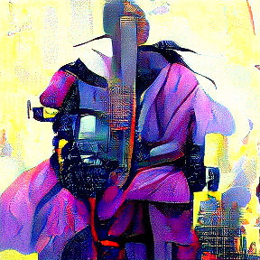
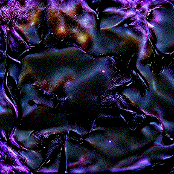
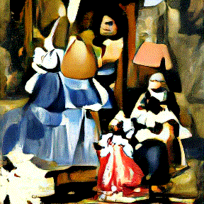
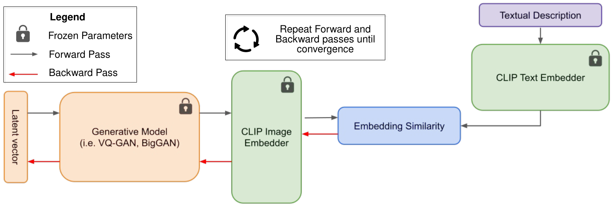
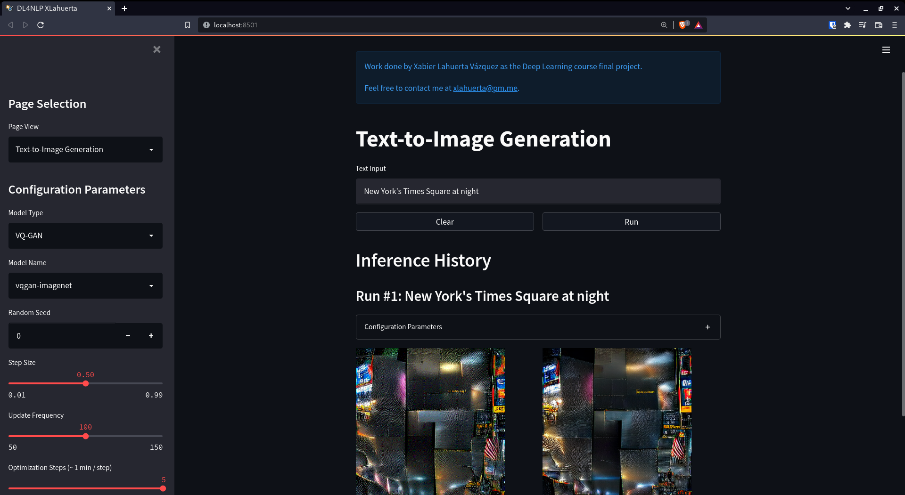
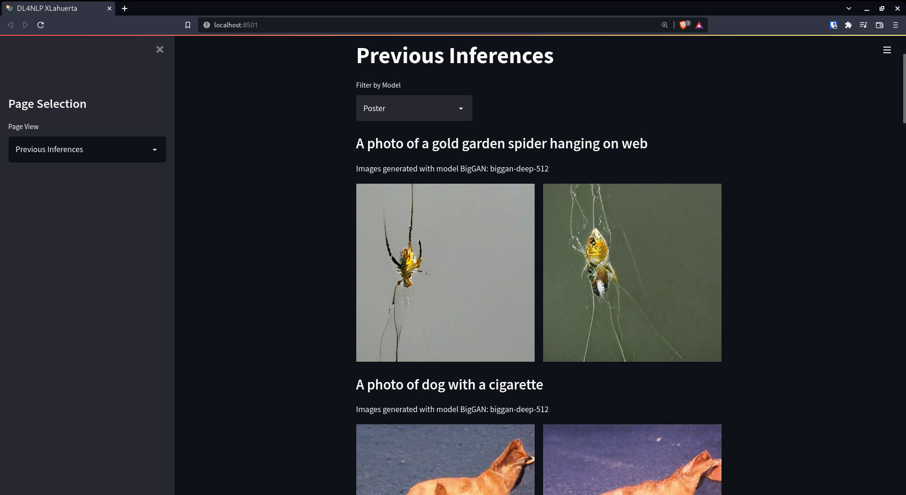
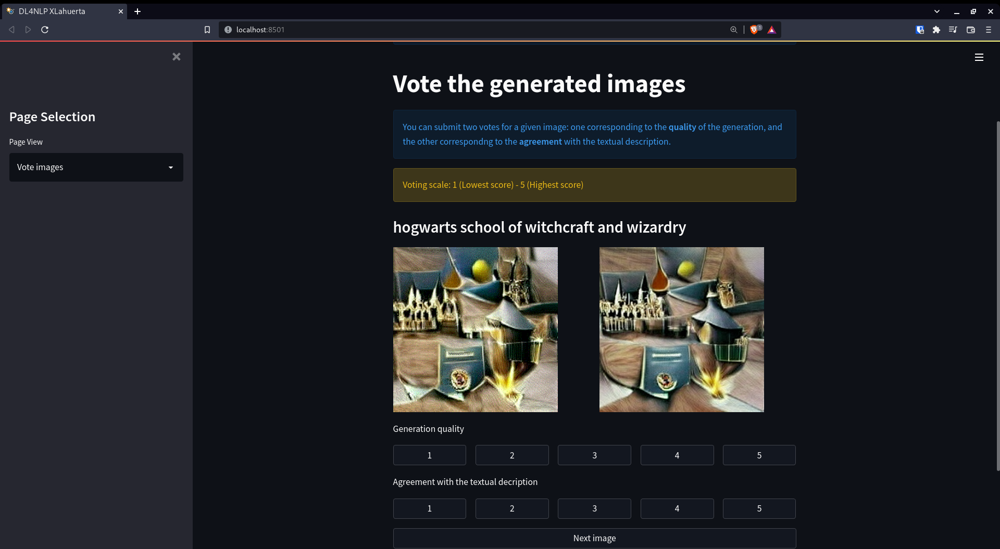

# Text-to-Image Generation

This is the implementation of the text-to-image generation system for the
[DL4NLP](https://ixa2.si.ehu.eus/deep_learning_seminar/) (Deep Learning for Natural Language Processing) course 
final project, as a [HAP/LAP](http://ixa.si.ehu.es/master/) master's student.

<table style="margin: 0 auto; width: 90%; text-align: center; font-weight: bold;">
    <tr>
        <td>Cyberpunk Samurai</td>
        <td>Dark Matter</td>
        <td>Flying penguin</td>
        <td>Las Meninas</td>
    </tr>
    <tr>
        <td></td>
        <td></td>
        <td></td>
        <td></td>
    </tr>
</table>

The table above shows several inferences, you can check more of them inside [inferences](res/inferences), 
[poster](res/poster) and [poster-session](res/poster-session). The latter folder contains the inferences made by
the people that attended the poster-session in-situ.

## System Description

<table style="margin: 0 auto; width: 90%; text-align: center; font-weight: bold;">
    <tr style="border: none;">
        <td style="border: none;"></td>
    </tr>
    <tr style="border: none;">
        <td style="border: none;">System Architecture</td>
    </tr>
</table>

The implemented system is composed of two main modules:

1. **Generative Module**: A generative network is used to generate an image from a latent vector.
2. **Language-Image Matching Module**: [CLIP](https://github.com/openai/CLIP) is used as the model to steer the image 
generation towards the provided textual description. 

Both modules are kept frozen, and the only parameters that are updated are those from the latent vector, such that 
the cosine similarity between the CLIP image embedding of the generated image and the CLIP text embedding of the 
provided textual description is maximized. This procedure is repeated for a predefined amount of iterations, or until
convergence.

## Streamlit Web Application

The Streamlit web application was built as a demo for the poster presentation session (you can check my poster 
[here](res/assets/Poster_XLahuerta.pdf)). At that time, this web app was being run in my personal computer sitting at 
home (for this reason, do not expect the QR code in the poster to work anymore). So, in order to handle possible 
concurrent text-to-image generation attempts, an SQLite3 based job queue was implemented from scratch. This way, we 
have two processes  working at the same time: the producer (in this case, the Streamlit web client) and the consumer 
([job_executor.py](job_executor.py)).

One of the major pros of this design is its scaling ability, both vertically and horizontally, by instantiating 
multiple [job_executor.py](job_executor.py) instances.

<table style="margin: 0 auto; width: 90%; text-align: center; font-weight: bold;">
    <tr style="border: none;">
        <td style="border: none;"></td>
    </tr>
    <tr style="border: none;">
        <td style="border: none;">Text-to-Image Generation Page View</td>
    </tr>
</table>

---

<table style="margin: 0 auto; width: 90%; text-align: center; font-weight: bold;">
    <tr style="border: none;">
        <td style="border: none;"></td>
    </tr>
    <tr style="border: none;">
        <td style="border: none;">Previous Inferences Page View</td>
    </tr>
</table>

---

<table style="margin: 0 auto; width: 90%; text-align: center; font-weight: bold;">
    <tr style="border: none;">
        <td style="border: none;"></td>
    </tr>
    <tr style="border: none;">
        <td style="border: none;">Vote Images Page View</td>
    </tr>
</table>

## Installation

First, you will need to install PyTorch with GPU compatibility. Follow the installation instructions 
[here](https://pytorch.org/get-started/locally/), and then run the command below:

```bash
pip3 install -r requirements.txt
```

## Usage

**WARNING**: if you plan to run this app, take into account that it has been implemented so that every tensor 
computation is done in the GPU. The GPU memory usage with the defaults implemented is around 5.9 GiB, but you can 
always tweak it by modifying the amount of data augmentations performed (32 by default), or changing the resolution of 
the image that is being generated (300x300 by default).

**NOTE**: If you have installed the requirements inside a virtual environment, you need to activate it inside
[set_up_env.sh](set_up_env.sh) and [run_executor.sh](run_executor.sh).

### Manual start

In order to run the system manually, we need to fire up the Streamlit web app, and also the 
[job_executor.py](job_executor.py) instance.

```bash
streamlit run webapp.py &
chmod u+x run_executor.sh
./run_executor.sh &
```

### Automated start

```bash
chmod u+x set_up_env.sh run_executor.sh
./set_up_env.sh
```

**NOTE 2**: [set_up_env.sh](set_up_env.sh) script creates a TMUX session and fires up both, the Streamlit web app and the 
[job_executor.py](job_executor.py) instance. It also creates a pane to check NVIDIA GPU usage by running 
`watch -n 0.1 nvdia-smi`.

## References

- Radford, A., Kim, J. W., Hallacy, C., Ramesh, A., Goh, G., Agarwal, S., ... & Sutskever, I. (2021, July). 
Learning transferable visual models from natural language supervision. In International Conference on Machine Learning 
(pp. 8748-8763). PMLR.
- Esser, P., Rombach, R., & Ommer, B. (2021). Taming transformers for high-resolution image synthesis. In Proceedings 
of the IEEE/CVF Conference on Computer Vision and Pattern Recognition (pp. 12873-12883).
- Brock, A., Donahue, J., & Simonyan, K. (2018). Large scale GAN training for high fidelity natural image synthesis. 
arXiv preprint arXiv:1809.11096.